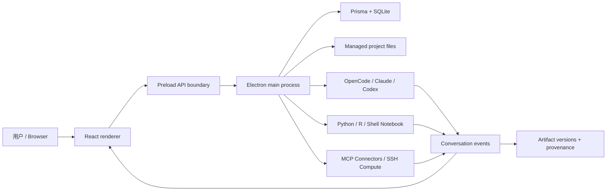

# 架构与数据流

Open Science 使用 Electron、React、TypeScript、Prisma 和 SQLite。主进程拥有文件、设置、数据库、运行时与 agent backend 集成；preload 以受控 API 把能力暴露给 renderer；renderer 呈现项目、对话、设置与预览。Web/headless 入口复用界面并通过本地受保护通道访问桌面进程能力。

## 关键所有权

- Settings store 与主进程 repository 协调配置写入，秘密经过安全存储/加密边界。
- Project/session store 负责 UI 状态，主进程 repository/DB 保存持久记录。
- ACP runtime 把 agent session、权限、计划、工具事件投影到 Conversation。
- Notebook runs 记录语言/agent/输入输出；artifact repository 建立 immutable version 与 provenance。
- Preview registry 按文件类型选择 renderer；受管理 PDF/Office/大资源拥有独立 lease/lifecycle。
- Permission grants 按 Global/Project/Session scope 聚合，Connector 与 Compute 仍有各自 policy。

## Wiki 架构

本 Wiki 使用 Docusaurus 的 autogenerated sidebar。`docs` 目录决定层级，文件 front matter 的 `sidebar_position` 决定同级顺序，各目录 `_category_.json` 提供分类标题和 generated index。截图位于 `static/img/open-science`，构建时映射为 `/img/open-science/...`。

